🛍️ My Store — MERN Stack E-Commerce Platform

A full-stack modern e-commerce web application built using the MERN Stack with separate Frontend, Backend, and Admin Panel powered by Vite.

This project includes authentication, product management, cart system, order handling, Razorpay payment integration, category filtering, bestseller sliders, and much more.

🚀 Tech Stack
Frontend
React.js (Vite)
React Router DOM
Axios
Tailwind CSS
JWT Authentication
Cookies
Razorpay Integration
Backend
Node.js
Express.js
MongoDB
Mongoose
Nodemailer
JWT
bcryptjs
CORS
Admin Panel
React.js + Vite
Product CRUD
Order Management
Bestseller Management
✨ Features
👤 User Features
User Signup / Signin / Logout
JWT Authentication
Secure Password Hashing using bcrypt
Product Collections
Category-wise Products
SubCategory Filtering
Bestseller Product Slider
Add to Cart
Buy Products
Razorpay Payment Gateway
Contact Page
About Page
Responsive UI
Cookies Handling
API Integration with Axios
🛒 Product Features
Dynamic Product Listing
Category & SubCategory Filters
Bestseller Products Slider
Product Search
Product Details Page
Product Image Upload
📦 Admin Panel Features
Product CRUD Operations
Add Products by Category/SubCategory
Order Management
Update Order Status:
Pending
Accept
Reject
Bestseller Product Management
Category-wise Bestseller Slider
📧 Backend Features
REST APIs
MongoDB Database
Nodemailer Email Integration
JWT Authentication
Express Router
Secure APIs
CORS Enabled
📁 Project Structure
My Store/
│
├── frontend/
│   ├── src/
│   ├── pages/
│   ├── components/
│   └── vite.config.js
│
├── backend/
│   ├── controllers/
│   ├── routes/
│   ├── models/
│   ├── middleware/
│   └── server.js
│
├── admin/
│   ├── src/
│   ├── pages/
│   └── components/
│
└── README.md
🔐 Authentication

Authentication is implemented using:

JWT Token
bcrypt Password Hashing
Cookies
💳 Payment Integration

Integrated with:

Razorpay Payment Gateway

Features:

Secure Checkout
Online Payment Processing
Order Handling
📧 Email Functionality

Using Nodemailer for:

Contact Form Emails
User Notifications
Admin Notifications
⚙️ Installation
1️⃣ Clone Repository
git clone https://github.com/Harsh33kumar/MyStore-Public.git
2️⃣ Install Dependencies
Frontend
cd frontend
npm install
Backend
cd backend
npm install
Admin
cd admin
npm install
3️⃣ Environment Variables

Create .env file inside backend:
<!-- don"t use the quortes where not given -->

MONGODB_URI=
PORT=5000
<!-- jwt -->
JWT_SECRET=
JWT_EXPIRES_IN="1d"

<!-- admin credentials -->
ADMIN_LOGIN = ""
ADMIN_PASSWORD =  ""

<!-- cloudinary -->
CLOUD_NAME= ''
API_KEY= 
API_SECRET= ''
API_ENV_VAR = ""

<!-- nodemailer -->
EMAIL_USER=
EMAIL_PASS=
ADMIN_EMAIL=

<!-- rozarpay -->
RAZORPAY_KEY_ID=
RAZORPAY_KEY_SECRET=

4️⃣ Run Project
Frontend
npm run dev
Backend
npm start
Admin
npm run dev

🌟 Future Improvements
Wishlist System
Product Reviews & Ratings
Order Tracking
Admin Analytics Dashboard
Coupons & Discounts
AI Product Recommendation
Multi Vendor Support

Add your project screenshots here.

Example:

HOME PAGE :
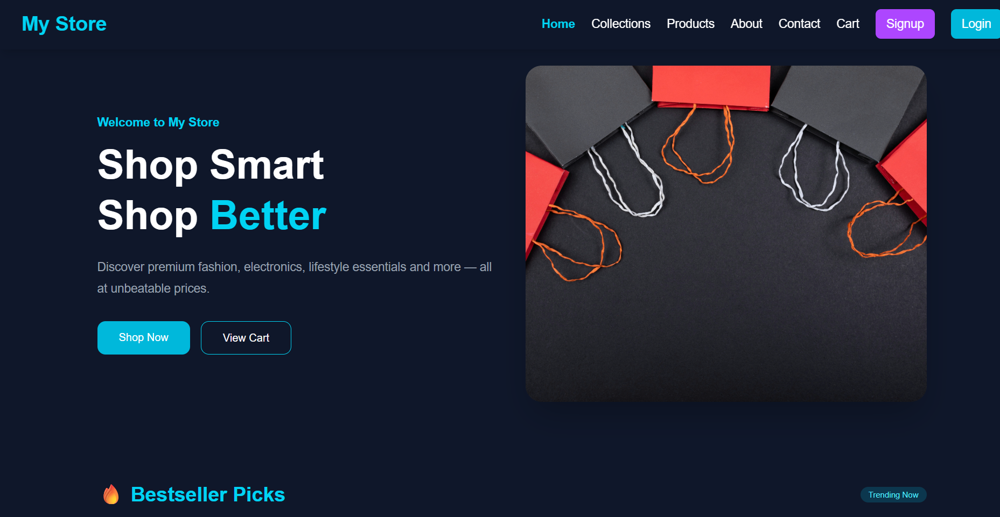
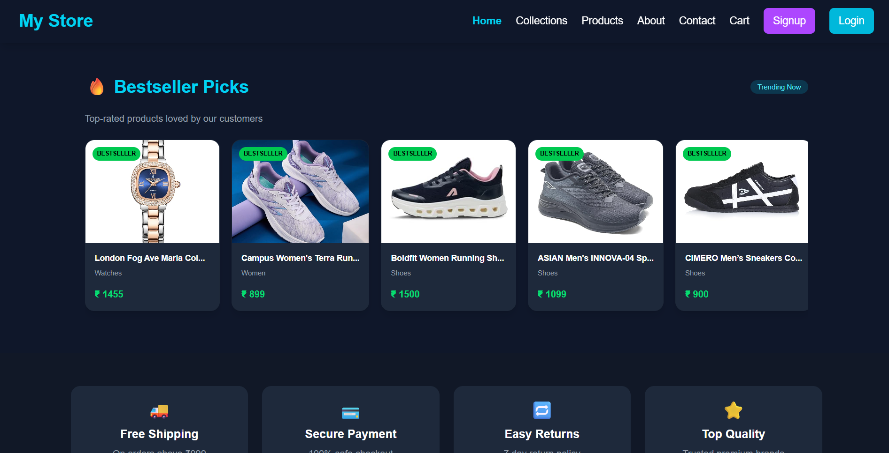
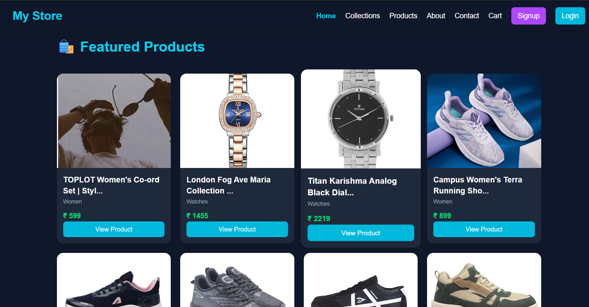

COLLECTIONS :
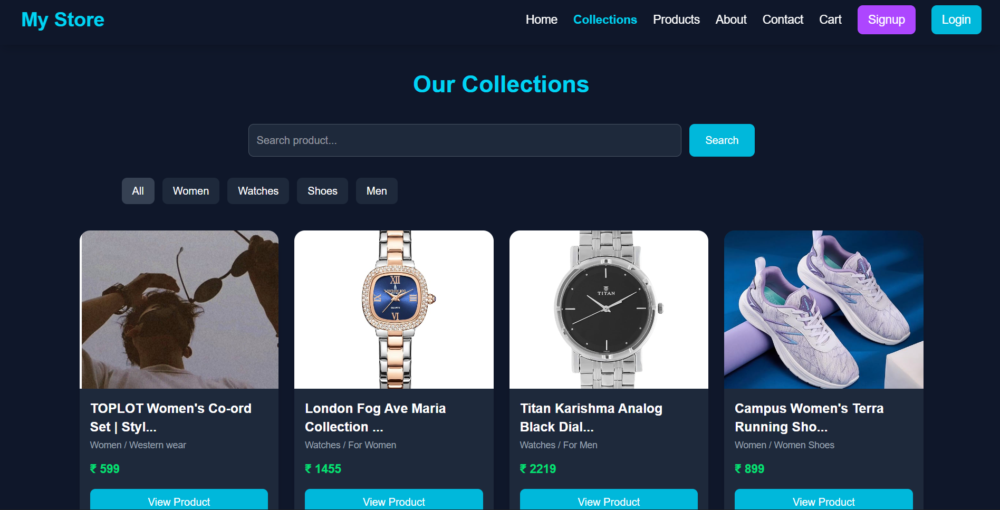

VIEW PRODUCT :
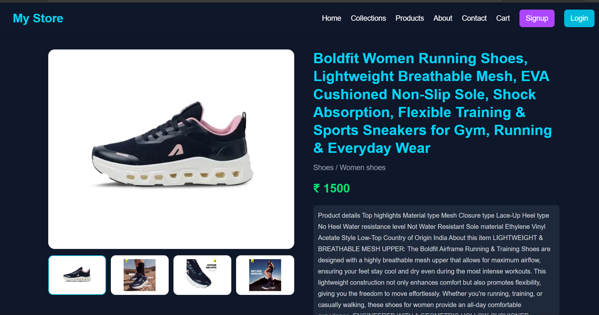
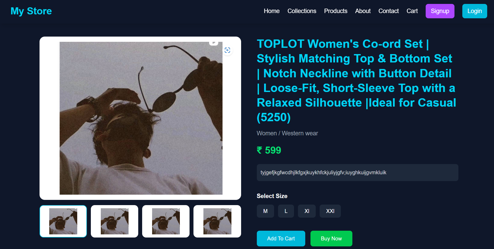

PRODUCTS:
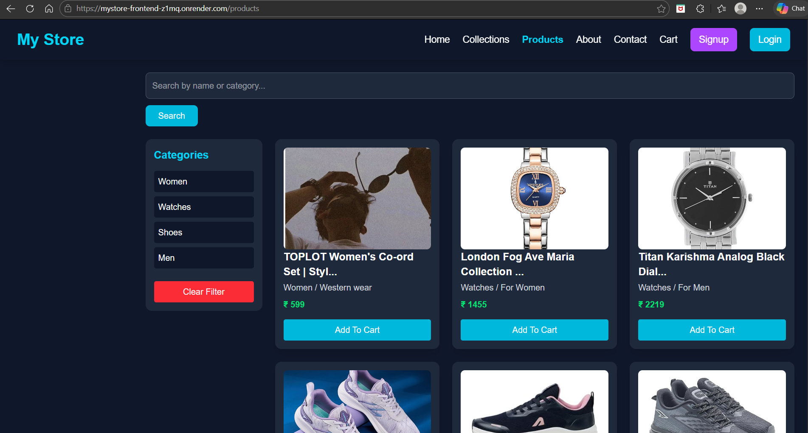

ABOUT US :
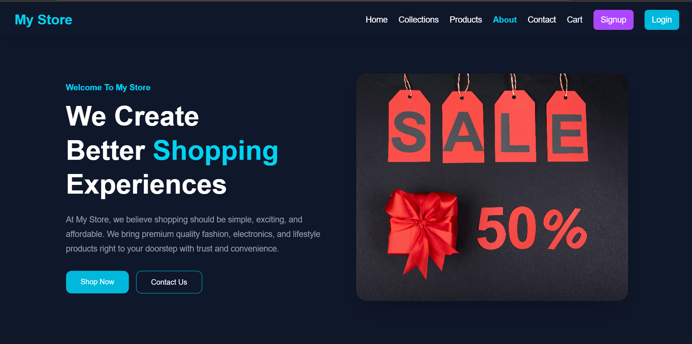
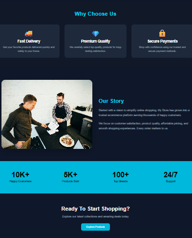

CONTACT US :
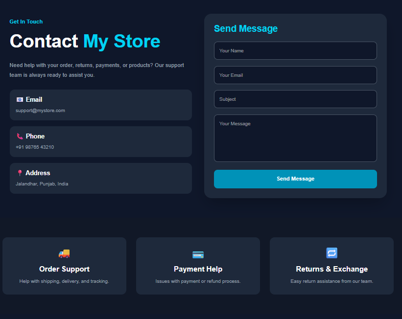

LOGIN:
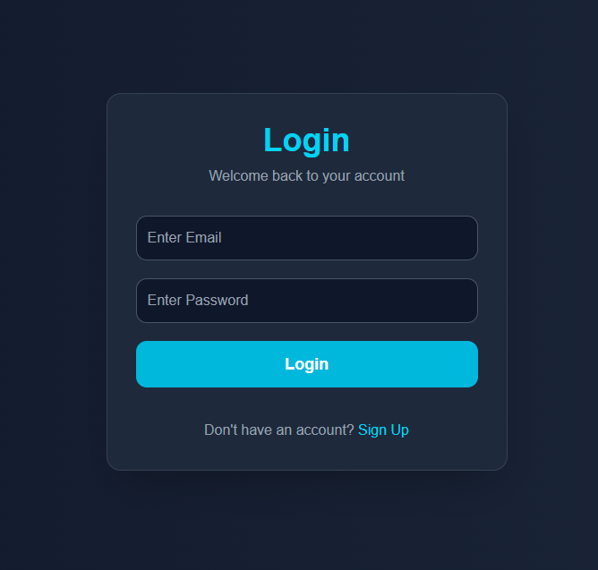

SIGNUP :
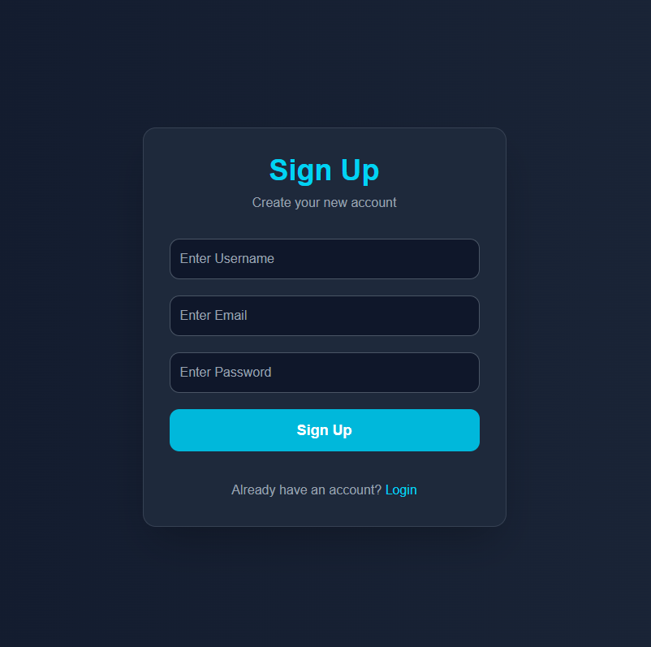

ADMIN DASHBOARD SECTION :

DASBOARD :
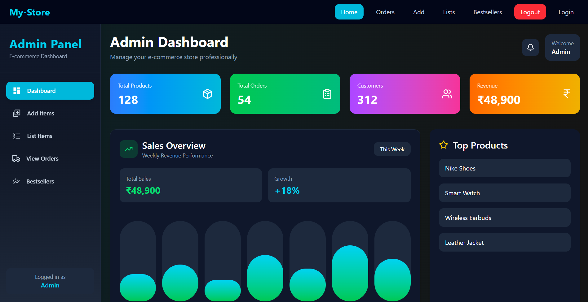

ADD PRODUCTS :
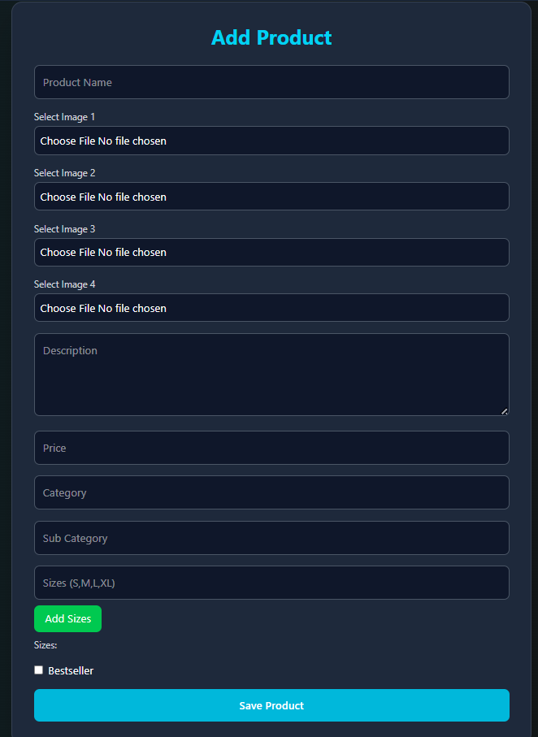

LIST PRODUCTS :
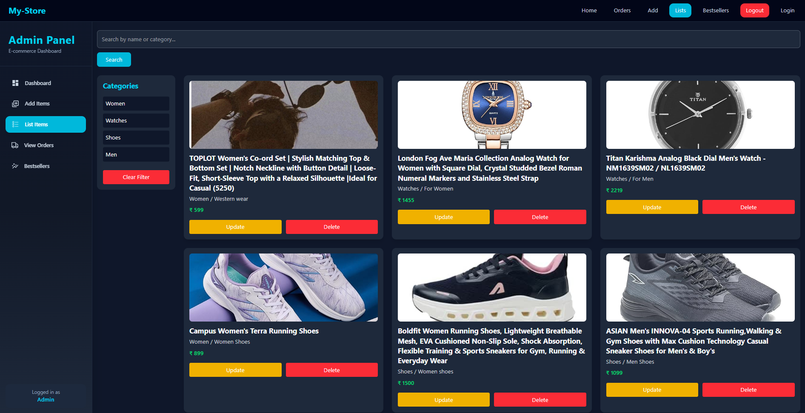

VIEW ALL ORDERS :
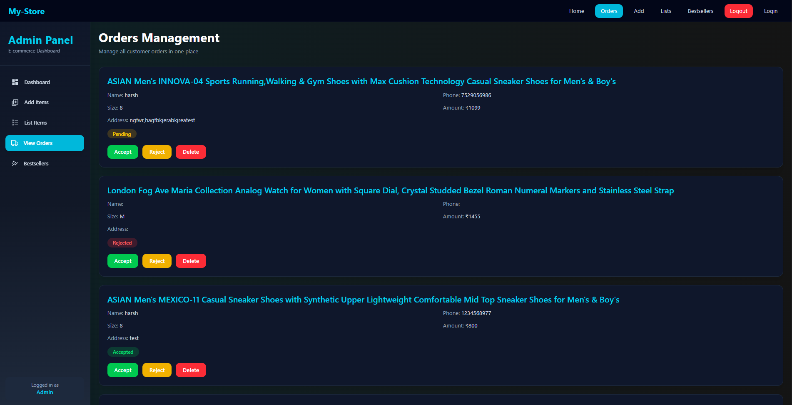

BEST SELLER :
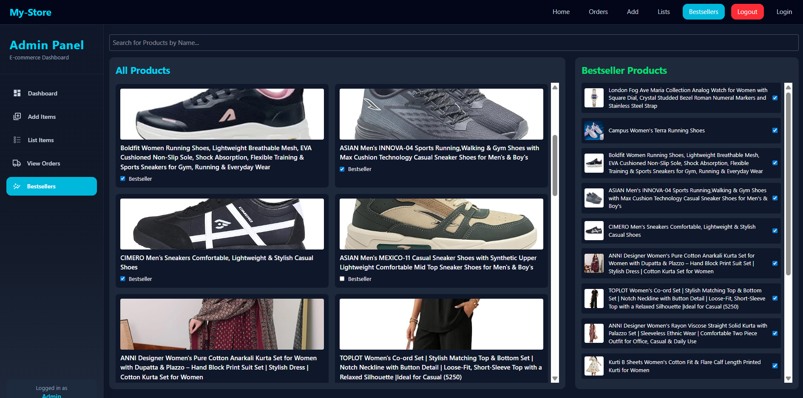
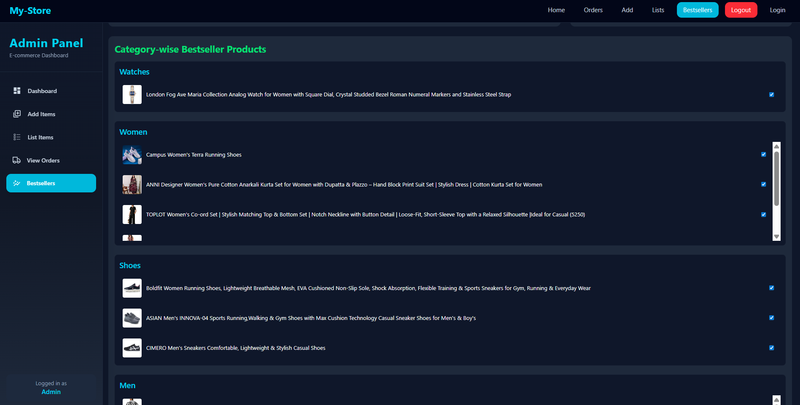
👨‍💻 Author

Developed by Harsh Kumar

visit the link: https://harsh33kumar.github.io/HARSH_PORTFOLIO/

MERN Stack Developer
Full Stack Web Developer

📄 License
This project is for learning and portfolio purposes.